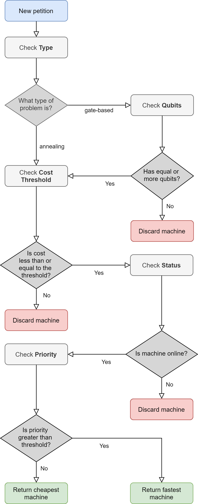

# Quantum API Gateway

## Description

This repository provides a Quantum API Gateway that can be used to obtain recommendations on which of the quantum processors available in Amazon Braket your quantum code should be executed. To do this, you must provide the Quantum API Gateway with the characteristics of your execution, and it will return the recommended machine, the cost of the execution and the estimated waiting time (based on other previous executions of similar characteristics and the time it has taken the last executions on the recommended machine).

The selection of the machines is made, roughly speaking, based on the flow shown in the following figure:

## Requirements

To run the gateway it is necessary to have the following software installed:

- Python 3
- pip3
- boto3 (with pip3)
- amazon-braket-sdk (with pip3)
- flask (with pip3)
- tensorflow (recommended version 1.14.0) (with pip3)
- keras (recommended version 2.3.1) (with pip3)
- sklearn

Previously execute, you must configure credentials and region to access AWS using boto3 in the files ~/.aws/credentials and ~/.aws/config, respectively 

## Starting Quantum API Gateway

Execute python3 main.py

You can re-train the deep learning model for waiting time forecasting executing "python3 generate_models"

## Operations
Two endpoints:

- GET /execute: Executes the Quantum API Gateway with the given input parameters and returns which is the best machine to execute the code with the described characteristics and the estimated time it will take to execute the code on this machine.

- POST /feedback: Serves to indicate to the Quantum API Gateway the time it has taken to finally execute the code, together with the context variables, in order to improve the model of waiting time forecasting.

###  Execute gateway (endpoint GET /execute)

This endpoint executes the gateway to return to which machine the code should be sent to execute (based on the characteristics of the code) and the estimated timeout for each machine (based on the characteristics of the code and the context).

To do this, it needs the following parameters (inputs) in JSON format in the body of the request:

- type: String (values from ["gate", "annealing"]).
- qubits: String
- priority: Number (integer values from 0 to 10). Priority level from 0 to 10, where 10 is the highest priority and 0 is the lowest priority.
- cost_threshold: Number. Upper limit value of the execution cost in USD. 
- shots: Number. Number of shots to be launched.

In response, it returns the code 200 along with a JSON with the following fields in the body (output):

- best_machine: String (values from ["riggeti_aspen8", "riggeti_aspen9", "ionq","dwave_advantage","dwave_dw2000"]). Name of the machine where it is recommended to run the code.
- estimated_time: Number. Estimated time to complete execution on the recommended machine (in seconds). If no time estimation models have been generated yet the returned value will be -1.
- estimated_cost: Number. Estimated cost in USD
If no machine matching the conditions is found, a 204 code will be returned with the following message in JSON:

- best_machine: null,
- reason: String. Reason why a suitable machine has not been found.

If something goes wrong, you will receive one of the following error codes:

- Code 400: Some of the inputs have not been indicated or some of the values are invalid (see "error" field in body).
- Code 404: There are not available machines that meet the requirements specified to that execution.
- Code 500: Something has gone wrong in the gateway. Check the console log.

###  Feedback for gateway (endpoint POST /feedback)

This endpoint executes the gateway to return to which machine the code should be sent to execute (based on the characteristics of the code) and the estimated timeout for each machine (based on the characteristics of the code and the context).

To do this, it needs the following parameters (inputs) in JSON format in the body of the request:

- machine: String (values from ["riggeti_aspen8", "riggeti_aspen9", "ionq","dwave_advantage","dwave_dw2000"]). Machine on which the code has been executed
- qubits: Number. Number of qubits in the circuit. If annealing, this value will be a null or 0.
[//]: <> (- complexity: Number. Number specifying the complexity of the code)
- shots: Number. Number of shots executed.
- time: Number. Time at which the execution started in seconds (for example, 01:00 UTC has value 3600).
- day: String (values from ["Mon", "Tue", "Wed", "Thu", "Fri", "Sat", "Sun"]). Day of the week on which the execution took place.
- execution_time: Number. Time (in seconds) it took to receive the results since you sent the code to be executed.

In response, it returns code 200 if all goes well. It returns nothing in the body

If something goes wrong, you will receive one of the following error codes:

- Code 400: Some of the inputs have not been indicated or some of the values are invalid (see "error" field in body).
- Code 500: Something has gone wrong in the gateway and the input could not be added to the feedback log. Check the log by console.

## Waiting time forecasting model

The models employed to forecast waiting time until result is available have been developed using Keras. It uses the parameters that are sent as input to GET /execute to calculate the waiting time. In addition, an LSTM layer is used to take into account the characteristics and time taken by previous executions on the same machine. The last 5 executions will be taken into account. If there are not at less five previous executions for a concrete machine, estimation time will be not know

Two models are generated: one for gate-based machines and one for annealing machines. The only difference is that the model for gate-based machines takes into account the number of qubits and the other does not.
- __Model inputs__:
    - machine: Quantum machine where code is going to be executed
    - qubits: Number of the qubits of the circuit (only in gate-based model)
    - shots: Number of shots to be executed
    - time: Hour of the day when code is going to be executed (in second)
    - day: Day of the week when code is going to be executed
    - previous_execution_time:
- __Model output__:
    - Time taken to obtain the result of the execution with the described characteristics (in seconds)
    
The model could be improved by changing the usage of the time taken for the last previous execution to the processor workload at the time of requesting the current execution. However, this information is not provided by AWS Braket at this time.

